# cids 
### technical background

***

# technical background 
- Components
- Application Types
- System Setup
- Customization
- Clarifications
- cids in Switch On

# Components
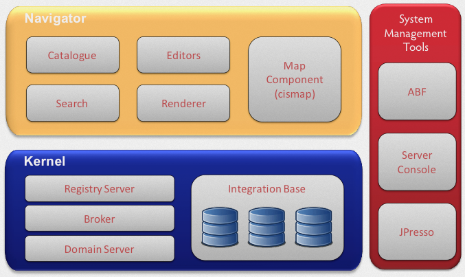

## Client


## Catalogue
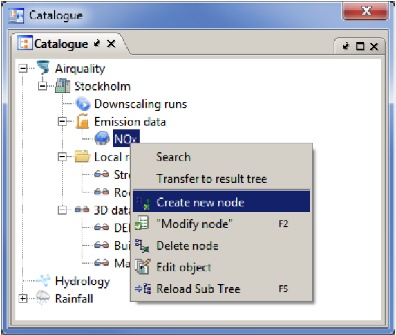

### static nodes, dynamic nodes, organisational nodes,  object nodes

## Renderer / Descriptionpage 
[](images/renderer.png)

### automatically generated, fully customisable

## Editors
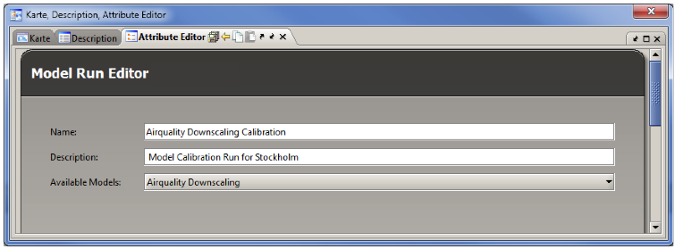

## Searches (Fulltext)

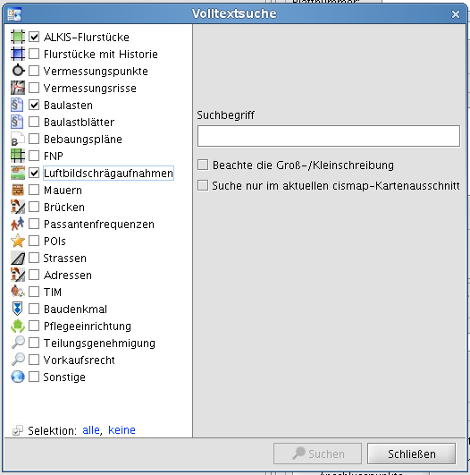 

## Searches (Geo)

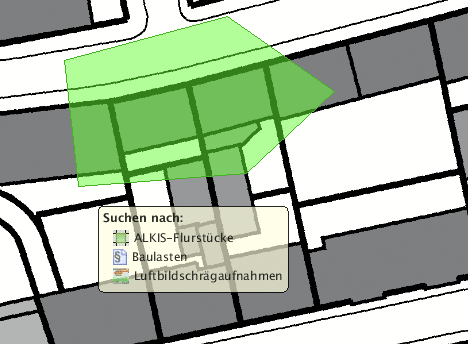 


## Searches (Custom)

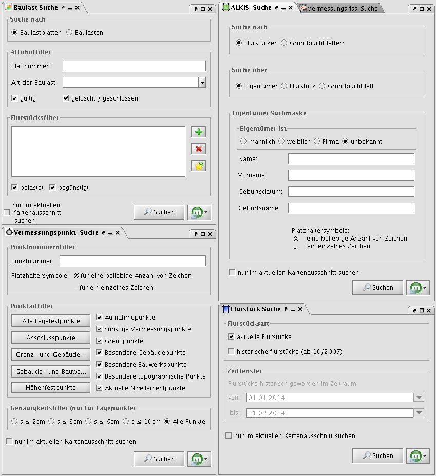 

## Map

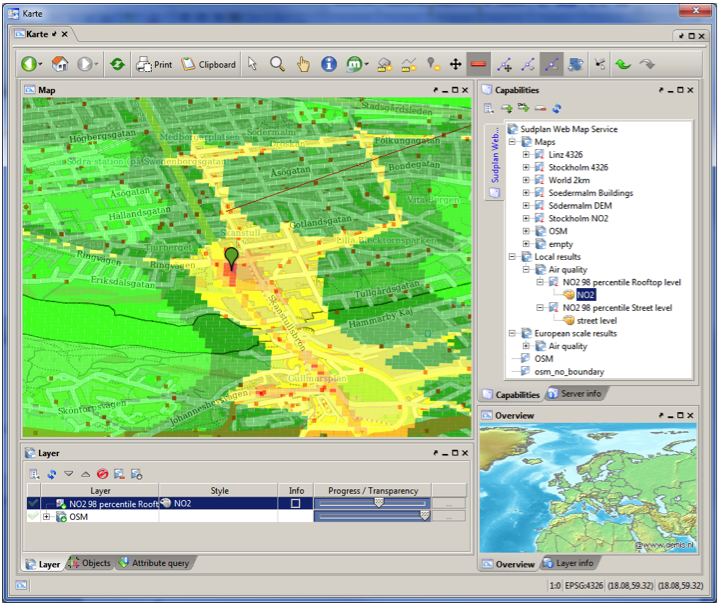

# Components

### next: Kernel


# Kernel

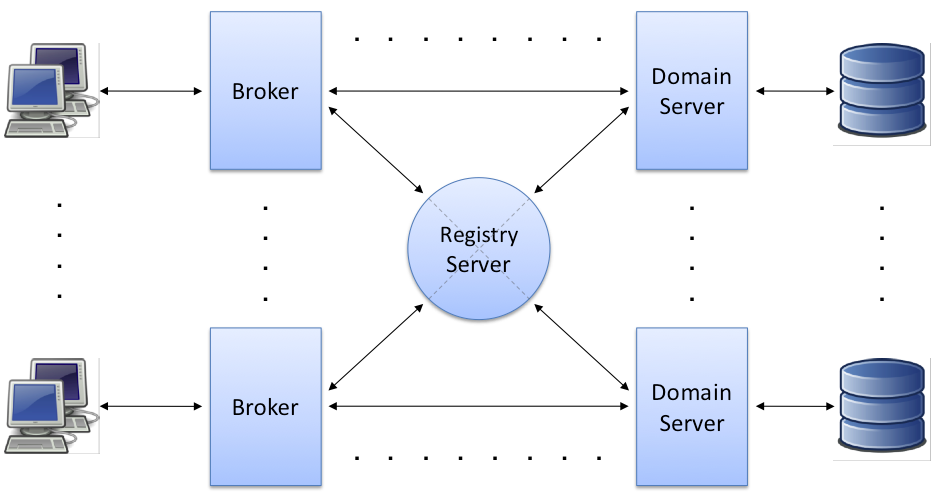

## Broker

* Proxy
* Communication endpoint for all clients

## Registry

* Name resolution
* Rights management
* Parallelised distributed search
* Core infrastructure functionalities

## Domain Server

* Object factory
* Object extension
* Catalogue factory
* User store
* Execution of server actions


## Integration Base

* RDBMS of the domain server
* System information in cs_-tables
 

## Structure of Integration Base

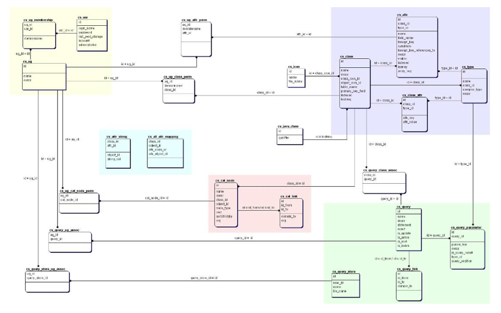

... and objecttables!

## Important tables

```sql
-- basic meta information
cs_class, cs_attr, cs_class_attr

-- catalogue
cs_cat_node, cs_cat_link

-- index
cs_attr_string, cs_attr_object, cs_attr_object_derived

-- users and groups
cs_domain, cs_policy, cs_usr, cs_ug, cs_ug_membership

-- permissions
cs_ug_class_perm, cs_ug_attr_perm, cs_ug_cat_node_perm
```

... and objecttables!


# Components

### next: System Management


## Server Console
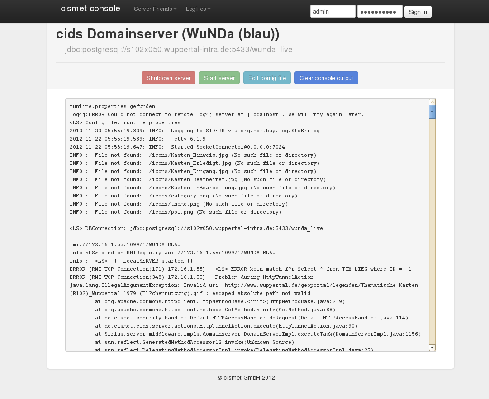

## JPresso
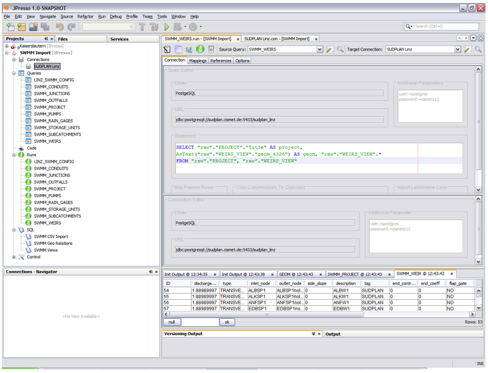

## ABF
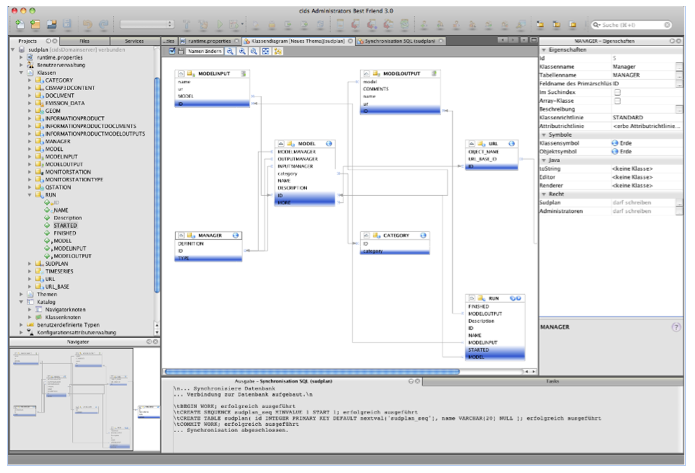


# Application Types


##  SG: Geodataviewer
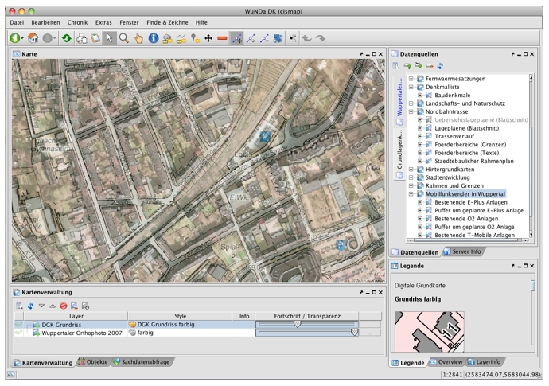

## SN: Complete System (including Navigator as Frontend)
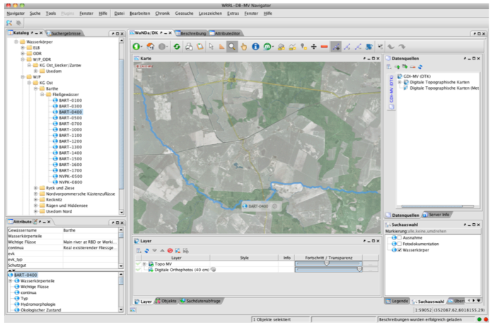

## SF: Custom Client (Fachanwendung)
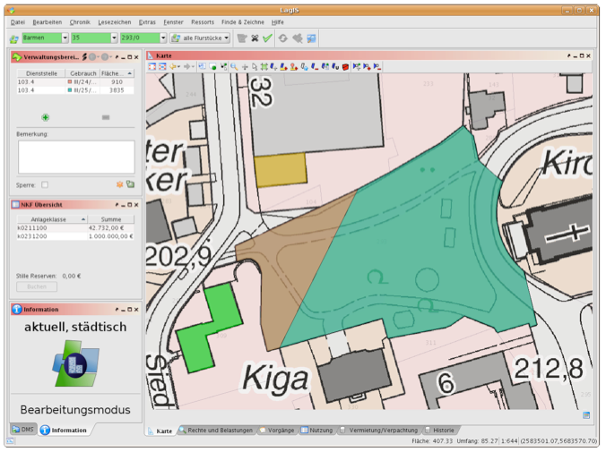

## SO: cids Server with proprietary clients

* Webapps
* Mobile Apps


## Hybrid Applications

All system classes are easiliy combinable. 

* cismap is a navigator plugin
* renderer can be shown in custom apps
* data from custom apps can be visualised in cids Navigator
* data from mobile apps can be processed with custom apps or the navigator and published via a web app

# System Setup

* Entity Definition
* Catalogue Definition
* Search Index Definition
* User Management Design


# Customization
```java
public FeatureAnnotationSymbol getPointSymbol() {
    int size=1;
    try {
        int number=new Integer(cidsBean.getProperty("hausnummer"));
        size+=number;
    } catch (Throwable t) {
        log.warn("Fehler in getPointSymbol()",t);
    }
    BufferedImage bi= new BufferedImage(size,size,BufferedImage.TYPE_INT_ARGB);
    Graphics2D graphics = (Graphics2D) bi.getGraphics();
    graphics.setColor(Color.orange);
    graphics.fillOval(0,0,size,size);
    FeatureAnnotationSymbol symb=new FeatureAnnotationSymbol(bi);
    symb.setSweetSpotX(0.5);
    symb.setSweetSpotY(0.5);
    return symb;
}
...
```

# Clarifications


# cids is


# cids is not 


# cids in Switch On
